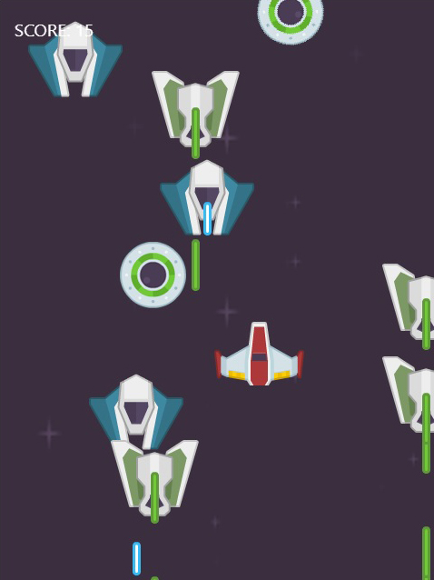

<h1 align='center'>Space Shooter</h1>

>Shooter Game is a game that uses Phaser library to manipulate the player and enemies' movements and shoots. We can create different scenes, obstacles and logic for our enemies. This project uses Async, await to make calls to the LeaderBoard API, where name and scores are kept. I used Javascript, LeaderBoard API, Phaser 3, and Jest.

 ## Day 2 of developing the game
 The main idea when I started the project was to create a game where the player could defeat enemies. These enemies should shoot the player and strike with the player to kill him. The enemies should have basic movements and not be static images. Player can also move to any direction to protect himself and to kill enemies.



<p><small>Game Screenshot</small></p><br /><br />

## Built With

- Phaser 3
- JavaScript
- Webpack
- Async/Await

## Dependencies

- Phaser
- Webpack
- Copy Webpack Plugin
- Babel
- Dotenv

## Game Design Document:

Click on this [link](https://docs.google.com/document/d/1rB3G0FsbbIbfmiYlE8-CgfTFxZ6IIRfyyTQKVSMinyo/edit?usp=sharing) to view the Game Design Document.

## Instructions to Play:

Use the arrows of your keyboard to move the ship around the space, and Space Bar to shoot laser on the enemies.

## Live Demo

[Live Demo](https://deploy-preview-1--hungry-brahmagupta-68b2f1.netlify.app/)

## Getting Started

To get a local copy up and running follow these simple example steps.

### Prerequisites

- Node.js
- VSCode
- Live Server (VSCode extension)

### Setup

<p>Clone this repo either by typing `git clone https://github.com/imran5644/js-space-shooter.git` (You must have git installed on your local machine in this case) or download a zip version of the code from GitHub.</p>

<p>Instal the dependencies with:</p>

```
  npm install
```

### Usage

Compile the code by typing the following command in your terminal (Make sure your in the root directory of your project):

```
  npm run build
```

Now open up VSCode and open the project folder. (Make sure you install Liver Server Extension in VSCode.) Right-click `index.html` which is inside the `Dist folder and click on `Open With Live Server`.

**Note:** You may not get the leaderboard on your local machine because you don't have access to the Game Id to correctly fetch the API.

## Author: Imran Yousaf

- Github: [@imran5644](https://github.com/imran5644)
- Twitter: [@imran56444](https://twitter.com/imran56444)
- LinkedIn: [Imran Yousaf](https://www.linkedin.com/in/imranyousaf-programmer/)

## 🤝 Contributing

Contributions, issues, and feature requests are welcome!

Feel free to check the [issues page](https://github.com/imran5644/space-shooter/issues).

## Show your support

Give a ⭐️ if you like this project!

## Acknowledgments

- [Microverse](https://www.microverse.org/)
- [Open Game Art](https://opengameart.org/)
- [Phaser 3](https://phaser.io/phaser3)
- [Kenny (Open Game Art Member)](https://opengameart.org/users/kenney)

### 📝 License

This project is MIT licensed.
